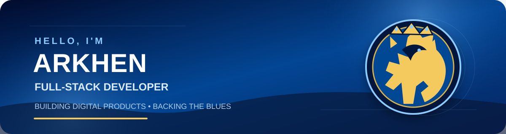

<div align="center">



<br />

### 💙 Full-Stack Developer · Web & Mobile Application Builder · Chelsea Supporter 🦁

I build modern web, mobile, ERP, and business management systems that turn real operational needs into practical digital products.

📍 Jakarta, Indonesia &nbsp;·&nbsp; 🔵 Proudly backing the Blues


</div>

---

## 🦁 About Me

- 💻 Building full-stack applications with modern JavaScript and TypeScript
- 📱 Developing cross-platform mobile applications with React Native and Expo
- 🧩 Experienced in ERP, logistics, point-of-sale, booking, and operational systems
- 🗄️ Working with PostgreSQL, Neon, Firebase, and API-driven architectures
- 🌱 Continuously improving system architecture, UI/UX, and deployment workflows

## 🔵 Tech Stack

<div align="center">


</div>

## 🏆 Featured Projects

<table>
<tr>
<td width="50%" valign="top">

### 🚚 [NexLogix](https://github.com/arkhenmmiracle/nexlogix-logistic)

A logistics management platform designed for fleet tracking, driver operations, route management, delivery proof, GPS monitoring, and fuel control.

**Focus:** Logistics · Operations · Dashboard

</td>
<td width="50%" valign="top">

### 🍽️ [NusaPOS F&B](https://github.com/arkhenmmiracle/nusapos-fnb)

A web-based point-of-sale and restaurant management system covering orders, tables, reservations, payments, inventory, purchasing, and reporting.

**Focus:** POS · Inventory · Restaurant ERP

</td>
</tr>
<tr>
<td width="50%" valign="top">

### 🎬 [CinePass](https://github.com/arkhenmmiracle/cinepass-web)

A modern movie discovery and ticket-booking experience with cinema selection, schedules, seat selection, order review, and payment flows.

**Focus:** Booking · Entertainment · Customer Experience

</td>
<td width="50%" valign="top">

### 🛵 [Laundry Driver](https://github.com/arkhenmmiracle/Laundry-Driver)

A mobile driver application for laundry pickup operations featuring attendance, task management, route tracking, OTP verification, photo proof, and order history.

**Focus:** React Native · Field Operations · Mobile

</td>
</tr>
</table>

## 📊 GitHub Overview

<div align="center">

[](https://github.com/arkhenmmiracle?tab=followers)
[](https://github.com/arkhenmmiracle?tab=repositories)

</div>

## ⚙️ What I Build

```text
Web Applications       → React, Next.js, Node.js
Mobile Applications    → React Native, Expo
Business Systems       → ERP, POS, Logistics, Operations
Backend & Data         → REST APIs, PostgreSQL, Neon, Firebase
Deployment             → GitHub, Vercel, Cloudflare
```

## 🤝 Let's Connect

I'm open to collaborating on web applications, mobile products, internal business systems, and digital transformation projects.

<div align="center">

[](https://github.com/arkhenmmiracle)

</div>

---

<div align="center">
<sub>Designed and maintained by Arkhen Miracle Putera · Code in blue 💙</sub>
</div>
