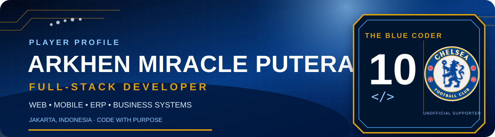

 

<table>
<tr>
<td width="34%" valign="top">

## 👤 Player Profile

📍 **Based in Jakarta, Indonesia**

💻 Full-Stack Developer focused on practical digital products.

📱 Building web, mobile, ERP, logistics, POS, and operational systems.

🤝 Open to collaboration and new development opportunities.

</td>
<td width="33%" valign="top">

## ⚽ Tech Formation

**Attack**

**Midfield**

**Defence**

</td>
<td width="33%" valign="top">

## 📊 Season Stats

⭐ **4** Featured Projects

🧩 **Full-Stack** Development

🖥️ **Web + Mobile** Products

🗄️ **API + Database** Systems

🚀 **GitHub + Vercel** Deployment

💙 **Chelsea** Supporter

</td>
</tr>
</table>

## 🏆 Starting XI Projects

<table>
<tr>
<td width="50%" valign="top">

### 🚚 [NexLogix](https://github.com/arkhenmmiracle/nexlogix-logistic)

Full-stack logistics platform for fleet tracking, driver operations, route management, delivery proof, GPS monitoring, and fuel control.

</td>
<td width="50%" valign="top">

### 🍽️ [NusaPOS F&B](https://github.com/arkhenmmiracle/nusapos-fnb)

Restaurant POS and management system covering orders, tables, reservations, payments, inventory, purchasing, and reporting.

</td>
</tr>
<tr>
<td width="50%" valign="top">

### 🎬 [CinePass](https://github.com/arkhenmmiracle/cinepass-web)

Modern cinema discovery and booking experience with schedules, seat selection, order review, and payment flows.

</td>
<td width="50%" valign="top">

### 🛵 [Laundry Driver](https://github.com/arkhenmmiracle/Laundry-Driver)

Mobile driver application featuring attendance, pickup tasks, route tracking, OTP verification, photo proof, and order history.

</td>
</tr>
</table>

## 🧠 Tactics Board

| ⚡ Frontend | 🧩 Backend | 🗄️ Data | 🚀 Delivery |
|:---:|:---:|:---:|:---:|
| React | Node.js | PostgreSQL | GitHub |
| Next.js | REST APIs | Neon | Vercel |
| React Native | Firebase | Data Modeling | Cloudflare |
| Tailwind CSS | Integration | Query Design | Deployment |

## 🤝 Transfer Window

I'm open to collaborating on web applications, mobile products, internal business systems, and digital transformation projects.

### “Code with discipline. Build with purpose. Play every match like it matters.” 💙

Designed and maintained by Arkhen Miracle Putera · Unofficial Chelsea supporter profile.

